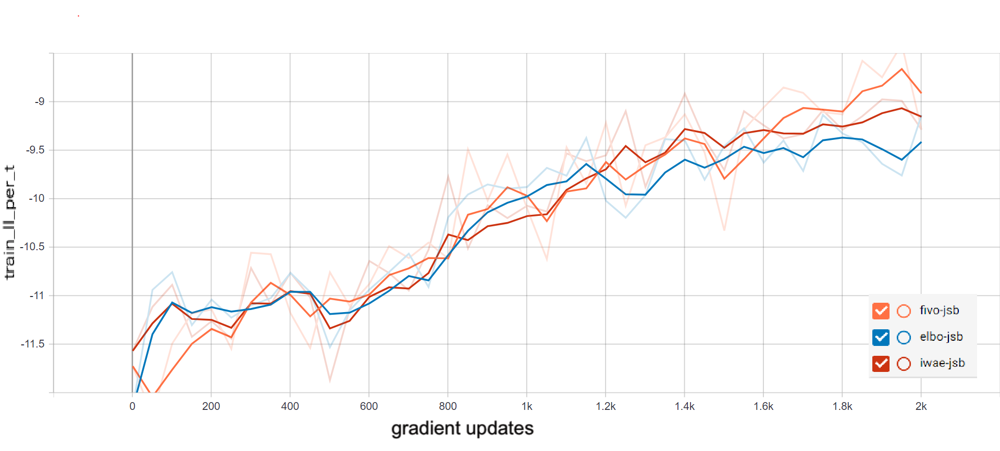
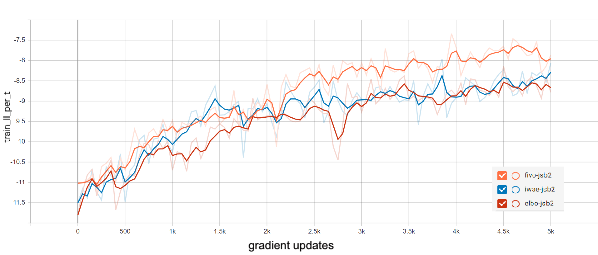
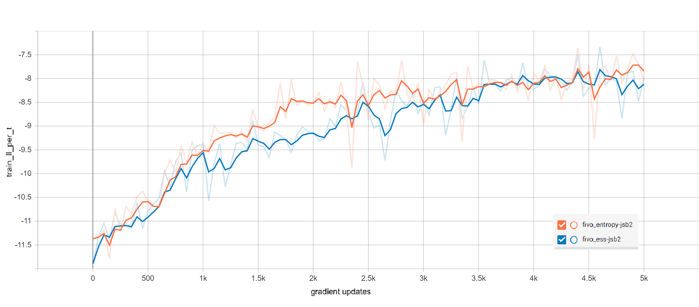

# Combining Variational Inference and Sequential MC methods using python
In this tutorial, we examined approaches to combining VI and sequential MC. We took a close look at
the line of work from  that introduced the family of ltering variational objectives (FIVO): a class
of lower bounds on the log marginal likelihood that extend the evidence lower bound commonly used
for VI. Conceptually,  introduced a view of marginal likelihood estimators as objectives instead of
algorithms for inference. These objectives are suited for MLE in latent variable models, and yield tighter
VI bounds for some sequential models.

## RESULTS
</img> 
</img> 
</img> 

## REFERNCES
[1] Chris J Maddison, John Lawson, George Tucker, Nicolas Heess, Mohammad Norouzi, Andriy Mnih,
Arnaud Doucet, and Yee Teh. Filtering variational objectives. In Advances in Neural Information
Processing Systems, pages 6576{6586, 2017.

[2] Tuan Anh Le, Maximilian Igl, Tom Rainforth, Tom Jin, and Frank Wood. Auto-encoding sequential
monte carlo. In Proceedings of the 6th International Conference on Learning Representations (ICLR),2018.

[3] Christian Naesseth, Scott Linderman, Rajesh Ranganath, and David Blei. Variational sequential
monte carlo. In International Conference on Articial Intelligence and Statistics, pages 968{977,
2018.

[4] Diederik P Kingma and Max Welling. Auto-encoding variational bayes. arXiv preprint
arXiv:1312.6114, 2013.

[5] Michael I Jordan, Zoubin Ghahramani, Tommi S Jaakkola, and Lawrence K Saul. An introduction
to variational methods for graphical models. Machine learning, 37(2):183{233, 1999.

[6] Thomas B. Schon, Fredrik Lindsten, Johan Dahlin, Johan Wagberg, Christian A. Naesseth, Andreas Svensson, and Liang Dai. Sequential Monte Carlo methods for system identication. 17th IFAC Symposium on System Identication (SYSID), 2015.

[7] Junyoung Chung, Kyle Kastner, Laurent Dinh, Kratarth Goel, Aaron C Courville, and Yoshua
Bengio. A recurrent latent variable model for sequential data. In Advances in neural information
processing systems, pages 2980{2988, 2015.
