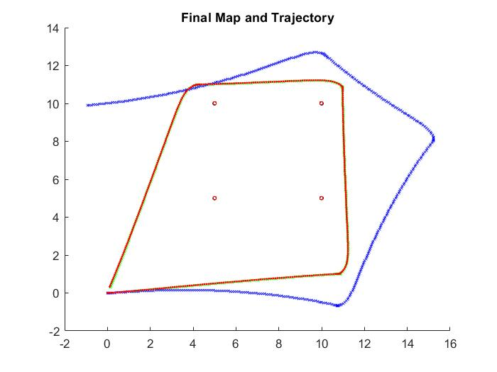
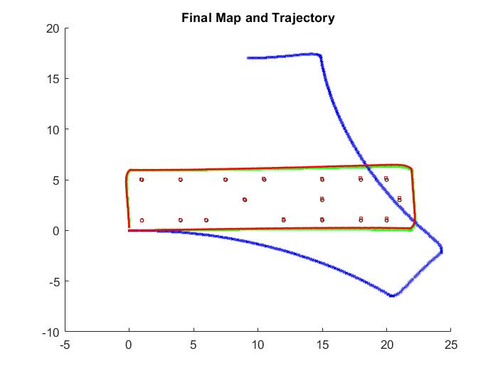
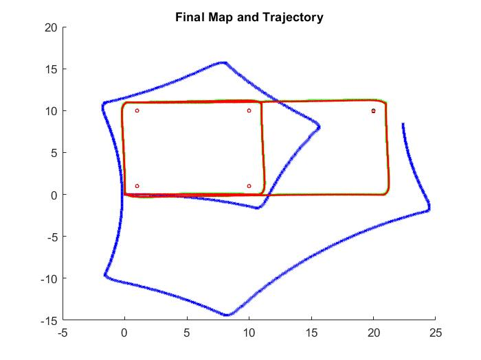
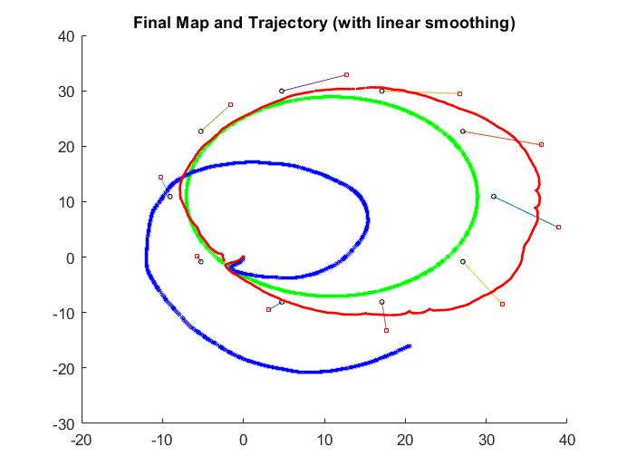
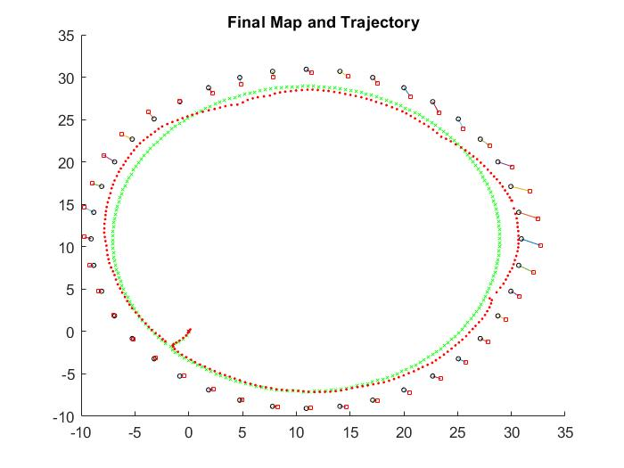

# Factor Graph Approach to Simultaneous Localization and Mapping
In this tutorial we will look at the factor graph approach to formulating this
problem and try out a simple Graph Slam implementation for point landmarks in
2D measured by a lidar sensor from robot with wheel encoders.

## RESULTS
</img> 
</img> 
</img> 
</img>
</img>

## REFERNCES
[1] D. Koller and N. Friedman, Probabilistic graphical models: principles
and techniques. MIT press, 2009.

[2] S. Thrun, W. Burgard, and D. Fox, Probabilistic robotics. MIT press,
2005.

[3] G. Grisetti, R. Kummerle, C. Stachniss, and W. Burgard, \A tutorial
on graph-based SLAM," IEEE Intelligent Transportation Systems Magazine,
vol. 2, no. 4, pp. 31{43, 2010.

[4] F. Dellaert and M. Kaess, \Square Root SAM: Simultaneous localization
and mapping via square root information smoothing," The International
Journal of Robotics Research, vol. 25, no. 12, pp. 1181{1203,
2006.

[5] T. B. Schon and F. Lindsten, \Manipulating the multivariate gaussian
density," Division of Au- tomatic Control, Linkoping University, Sweden,
Tech. Rep, 201
