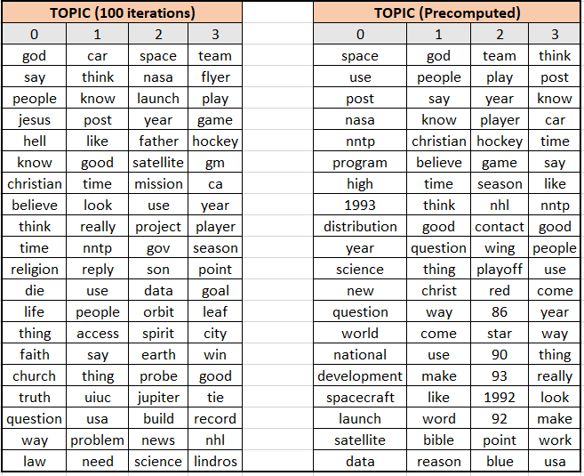
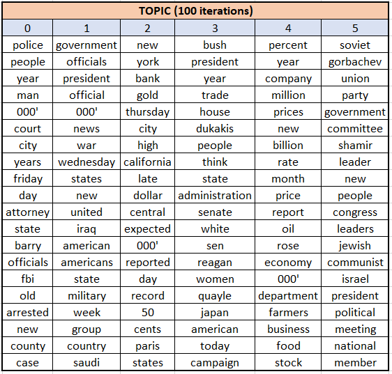

# Topic Clustering Using LDA 
In this tutorial,  I implemented LDA, approximated the necessary variational parameters, and examined the results to infer information about topics in documents on the Associated Press docs dataset , Moody Lyrics dataset and the newsgroup dataset from scikit-learn.

## RESULTS
</img> 
</img> 

## REFERNCES
[1] David M. Blei, Andrew Y. Ng, and Michael I. Jordan. 2003. Latent dirichlet allocation. J. Mach. Learn. Res. 3, null (March 2003), 993–1022.

