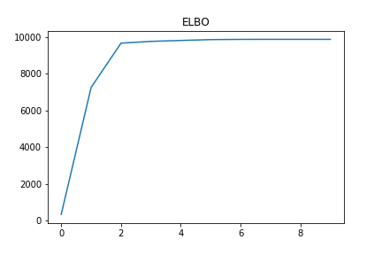

# Variational Inference on Gaussian Mixture Models
In this tutorial,  I focus on Variational Inference on Multivariate Gaussian Mixture Model.The algorithmic derivation and implementation in python.

## RESULTS
</img> 
</img>
</img>

## REFERNCES

1. Jordan, Michael I., et al. "An introduction to variational methods for
graphical models." Machine learning 37.2 (1999): 183-233.

2. Blei, David M., Alp Kucukelbir, and Jon D. McAulie. "Variational in-
ference: A review for statisticians." Journal of the American Statistical
Association just-accepted (2017).

3. D. Koller and N. Friedman. Probabilistic Graphical Models: Principles
and Techniques. MIT Press, 2009.

4. Christopher M. Bishop,"Pattern Recognition and Machine Learning","Springer,
2006.

5. Wainwright, Martin J., and Michael I. Jordan. "Graphical models, ex-
ponential families, and variational inference." Foundations and Trends in
Machine Learning 1.12 (2008): 1-305.

6. Blei, David M., and Michael I. Jordan. "Variational inference for Dirichlet
process mixtures." Bayesian analysis 1.1 (2006): 121-143.

7. Homan, Matthew D., et al. "Stochastic variational inference." The Jour-
nal of Machine Learning Research 14.1 (2013): 1303-1347.

